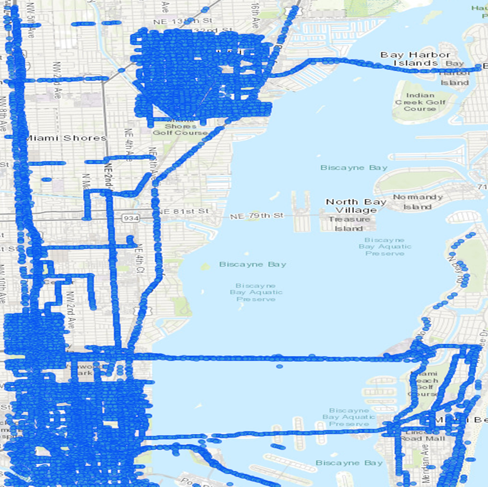
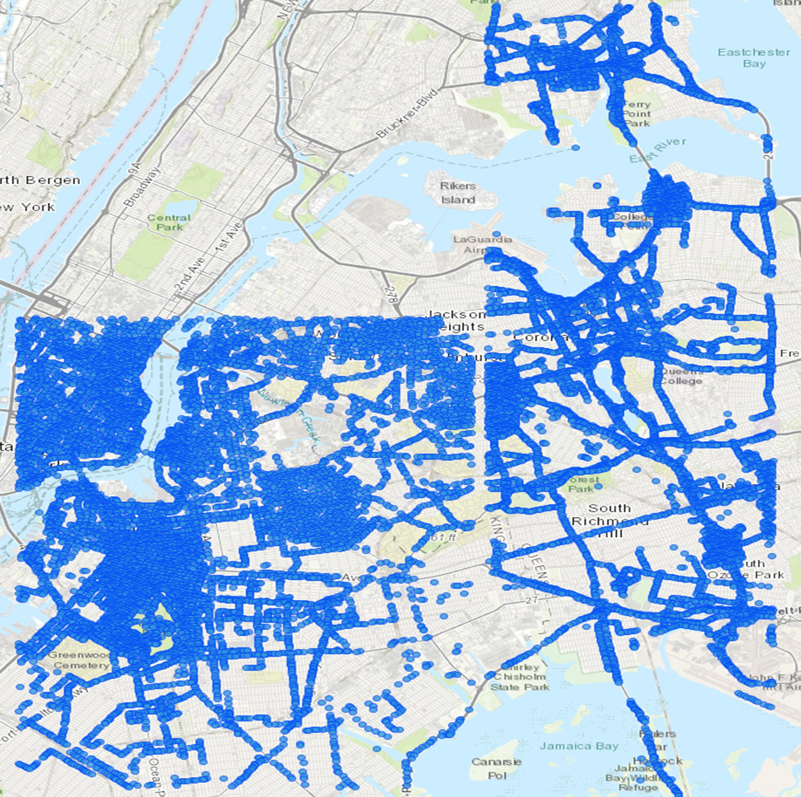
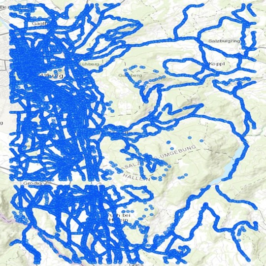
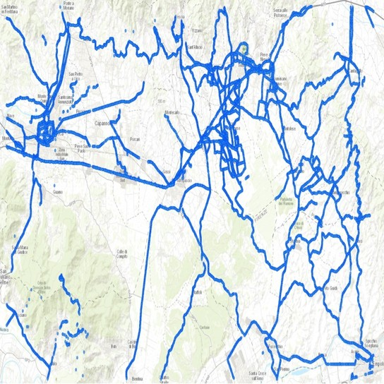
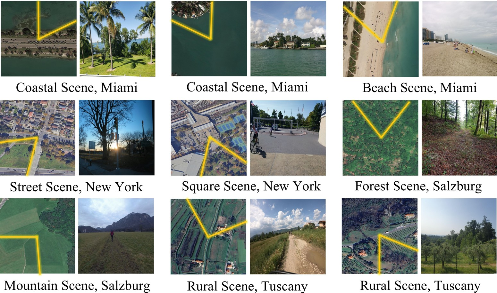
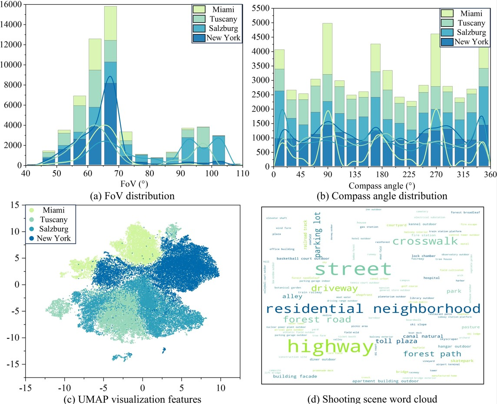
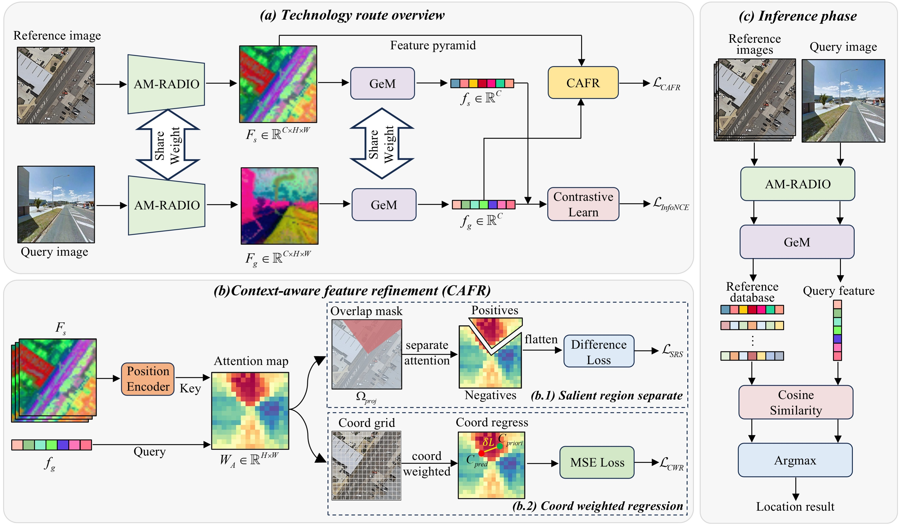
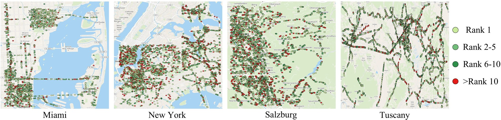

🎯🌐🔍 CAFR: Context-Aware Feature Refinement for Narrow Field-of-View Cross-View Geo-Localization
==================================================================================================

Description 📜
--------------

While existing work in cross-view geo-localization (CVGL) predominantly localizes 360° panoramic images using satellite imagery, real-world query images often have a narrow field-of-view (FoV). This narrower FoV results in significantly smaller overlapping regions between query and satellite images, posing distinct challenges.

We propose **Context-Aware Feature Refinement (CAFR)**, a novel framework that transforms geometric priors within overlapping regions into differentiable supervision signals to directly constrain cross-attention matrices. CAFR introduces two key modules:

* **Salient Region Separation (SRS)**: Enforces spatial consistency between attention matrices and overlapping regions

* **Coord Weighted Regression (CWR)**: Aligns attention peaks with region centers to enhance feature discriminability

CVNAF Dataset: Cross-View Narrow FoV Benchmark 💾
-------------------------------------------------

To address limitations of existing datasets, we constructed the **CVNAF**​ dataset - the first NCVGL benchmark that:

* Contains real perspective images (not panoramic crops)

* Establishes projection relationships between ground and satellite imagery

* Covers diverse environments: urban, rural, coastal, and mountainous regions
  
To download this dataset, you can click: [🤗CVNAF](https://www.modelscope.cn/datasets/hobefrank/CVNAF/files).

### Dataset Statistics 📊

* **Total Samples**: 56,825 ground-satellite pairs

* **Coverage**: Miami, New York, Salzburg, and Tuscany

* **FoV Range**: 40°-110° (reflecting real-world conditions)

* **Training/Test Split**: 4:1 ratio

### Sample Distribution 📍

<table style="text-align: center">

<tr>

<td style="text-align: center"></td>

<td style="text-align: center"></td>

<td style="text-align: center"></td>

<td style="text-align: center"></td>

</tr>

<tr>

<td style="text-align: center">Miami</td>

<td style="text-align: center">New York</td>

<td style="text-align: center">Salzburg</td>

<td style="text-align: center">Tuscany</td>

</tr>

</table>

### Example image 📊

<td style="text-align: center"></td>

### CVNAF ground image statistics 📊

<td style="text-align: center"></td>

Framework Architecture 🖇️
--------------------------
## Framework 📊️
<td style="text-align: center"></td>

Key Features ✨
--------------

### Multi-scale Cross-Attention Construction

* Builds feature pyramids to handle scale variations

* Incorporates relative positional encoding (RPE) for geometric awareness

* Computes cross-attention between ground and satellite features

### Salient Region Separation (SRS) Module

* Employs region contrast strategy to amplify response differences

* Suppresses non-overlapping regions through spatial consistency

* Uses novel SRS loss for adaptive attention allocation

### Coord Weighted Regression (CWR) Module

* Performs attention-weighted coordinate regression

* Ensures attention peaks align with overlapping region centers

* Provides fine-grained geometric supervision

Performance Results 🚀
--------------------------
<table>
  <thead>
    <tr>
      <th style="padding: 8px 12px; text-align: center; vertical-align: middle;">Method</th>
      <th style="padding: 8px 12px; text-align: center; vertical-align: middle;">CVUSA Avg. R@1</th>
      <th style="padding: 8px 12px; text-align: center; vertical-align: middle;">CVACT Avg. R@1</th>
      <th style="padding: 8px 12px; text-align: center; vertical-align: middle;">CVNAF Avg. R@1</th>
    </tr>
  </thead>
  <tbody>
    <tr>
      <td style="text-align: center">Sample4Geo</td>
      <td style="text-align: center">48.0%</td>
      <td style="text-align: center">25.9%</td>
      <td style="text-align: center;">28.3%</td>
    </tr>
    <tr>
      <td style="text-align: center">CV-cities</td>
      <td style="padding: 8px 12px; text-align: center; vertical-align: middle;">64.0%</td>
      <td style="padding: 8px 12px; text-align: center; vertical-align: middle;">51.5%</td>
      <td style="padding: 8px 12px; text-align: center; vertical-align: middle;">37.3%</td>
    </tr>
    <tr>
      <td style="padding: 8px 12px; text-align: center; vertical-align: middle;">ConGeo</td>
      <td style="padding: 8px 12px; text-align: center; vertical-align: middle;">46.5%</td>
      <td style="padding: 8px 12px; text-align: center; vertical-align: middle;">32.6%</td>
      <td style="padding: 8px 12px; text-align: center; vertical-align: middle;">28.5%</td>
    </tr>
    <tr>
      <td style="padding: 8px 12px; text-align: center; vertical-align: middle;"><strong>CAFR (Ours)</strong></td>
      <td style="padding: 8px 12px; text-align: center; vertical-align: middle;"><strong>70.5%</strong></td>
      <td style="padding: 8px 12px; text-align: center; vertical-align: middle;"><strong>56.0%</strong></td>
      <td style="padding: 8px 12px; text-align: center; vertical-align: middle;"><strong>46.9%</strong></td>
    </tr>
  </tbody>
</table>

Distribution of localization 🚿
-----------------------
<td style="text-align: center"></td>

Installation & Usage 🚂
-----------------------

### Requirements

    pip install -r requirements.txt

### Training

    cd cafr/train
    python train_cafr.py

------------------

This work is supported by the Natural Science Foundation of China (Grant No.42501543). We thank the authors of:

* [AM-RADIO](https://github.com/NVlabs/RADIO) for the backbone network

* [CV-cities](https://github.com/GaoShuang98/CVCities) and [Sample4Geo](https://github.com/Skyy93/Sample4Geo) for trainning framework

* * *

**🌟 Star us on GitHub if you find this project helpful! 🌟**

